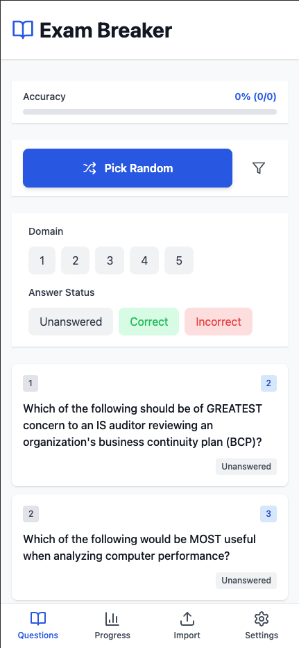
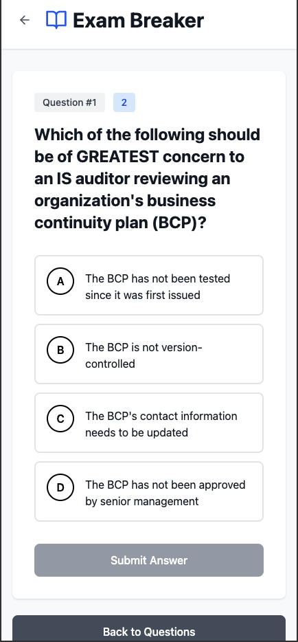
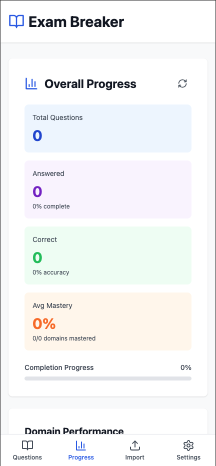
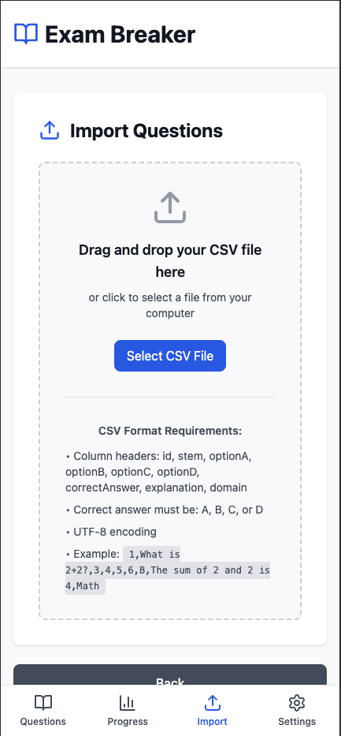
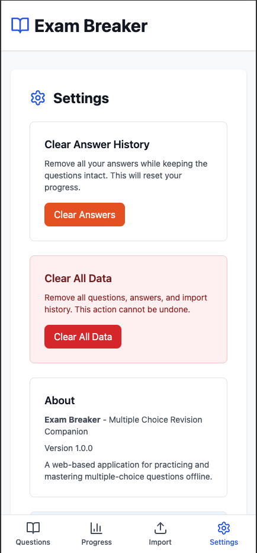

# Exam Breaker 2 - Multiple Choice Revision Companion

**Study multiple choice questions anywhere, anytime** with Exam Breaker—a mobile-first web app designed for practicing and revising your knowledge on-the-go. Perfect for revising while commuting, waiting in queues, or taking quick study breaks.

---

## About

Exam Breaker is a mobile-optimized web application that helps students and professionals practice multiple-choice exams efficiently. Whether you're preparing for certifications, standardized tests, or educational exams, Exam Breaker makes it easy to study your own questions with progress tracking and detailed explanations to reinforce your learning.

---

## Key Features

- **Flexible CSV Import** - Import questions from a CSV file with your own question data (see format below)
- **Domain Filtering** - Filter questions by specific domains/topics to focus your study on particular subjects
- **Random Questions with Spaced Repetition** - Weighted random selection prioritises unanswered and incorrectly answered questions
- **Timed Exam Mode** - Simulate real exams with configurable question count, time limit, and domain selection. Get scored results with domain breakdown
- **Flashcards** - Study with flip-card style flashcards, filterable by domain and shuffleable
- **Bookmarks** - Bookmark questions for quick access later
- **Progress Analytics** - Track your mastery level by domain with detailed statistics on correct/incorrect answers and attempt counts
- **LaTeX Support** - Questions and answers can include LaTeX math notation (rendered via KaTeX)
- **Multi-Answer Questions** - Supports questions with multiple correct answers (e.g. "A,B,D")
- **Backup & Restore** - Export and import your progress data (answers and bookmarks) as JSON
- **Offline Support** - Fully functional offline with IndexedDB (Dexie) local storage—study anywhere without internet
- **Detailed Explanations** - Every question includes explanations for why the answer is correct and why others are incorrect
- **Mobile-First Design** - Optimised for mobile devices with responsive layout and bottom tab navigation
- **Dark Mode** - Full dark mode support

---

## Tech Stack

- **Frontend**: React 18 with TypeScript 5
- **Build Tool**: Vite 7
- **Database**: Dexie 4 (IndexedDB wrapper for local storage)
- **Styling**: Tailwind CSS 3.4 with PostCSS
- **Icons**: Lucide React
- **LaTeX Rendering**: KaTeX (lazy-loaded)
- **Deployment**: GitHub Pages
- **Runtime**: ES Modules

---

## CSV Import Format

Exam Breaker uses a v2 CSV format with the following headers:

```
No.,Question,OptionA,OptionB,OptionC,OptionD,Answer,Domain,Name of domain,Simplified,Why the answer is correct,Why others are incorrect,Key words,Full_Question
```

### Example Row

```
1,"What is the capital of France?","London","Paris","Berlin","Madrid",B,GEO,"Geography","Capital city of France","Paris is the capital and largest city of France.","London is UK, Berlin is Germany, Madrid is Spain","capital, France, Paris","What is the capital of France?"
```

### Field Reference

| Field | Required | Description |
|---|---|---|
| `No.` | Yes | Unique numeric identifier |
| `Question` | Yes | The question text |
| `OptionA` - `OptionD` | Yes | Four answer choices |
| `Answer` | Yes | Correct answer letter(s). Single (`B`) or multiple (`A,B,D`) |
| `Domain` | Yes | Domain/topic code for filtering |
| `Name of domain` | No | Human-readable domain name |
| `Simplified` | No | Simplified version of the question |
| `Why the answer is correct` | No | Explanation for the correct answer |
| `Why others are incorrect` | No | Explanation for why other options are wrong |
| `Key words` | No | Keywords for the question |
| `Full_Question` | No | Full unabridged question text |

---

## How It Works

1. **Import Questions** - Upload your CSV file. Exam Breaker validates and parses the data, providing detailed feedback on any errors.

2. **Browse & Study** - View all your questions organised by domain. Use domain filters to focus on specific topics or select random questions for comprehensive review.

3. **Answer & Learn** - Select your answer and immediately see if it's correct. Read the detailed explanation to understand the concept better.

4. **Take Exams** - Configure a timed exam with your chosen question count, time limit, and optional domain filter. Get scored results with per-domain breakdown.

5. **Use Flashcards** - Flip through question/answer cards to reinforce memory. Filter by domain and shuffle for variety.

6. **Track Progress** - Monitor your mastery percentage by domain. See statistics on total questions, correct answers, and attempt history.

All your data is stored locally in your browser—no server uploads, complete privacy.

---

## UI Preview

### Question List View


### Question Detail View

.png)
.png)
.png)

### Progress Analytics


### Import Page


### Settings


---

## Getting Started

### Installation

```bash
# Clone the repository
git clone https://github.com/Hercules03/Exam-Breaker-2.git
cd Exam-Breaker-2

# Install dependencies
npm install

# Start development server
npm run dev
```

### Build for Production

```bash
npm run build
npm run preview
```

### Deploy to GitHub Pages

```bash
npm run deploy
```

---

## Live Demo

**Try it now**: https://hercules03.github.io/Exam-Breaker-2/

---

## Browser Support

- Chrome/Edge 90+
- Firefox 88+
- Safari 14+
- Mobile browsers (iOS Safari, Chrome Mobile)

---

## License

This project is open source and available under the MIT License.
